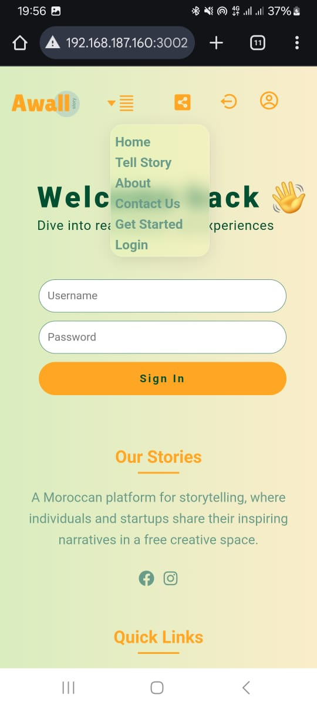
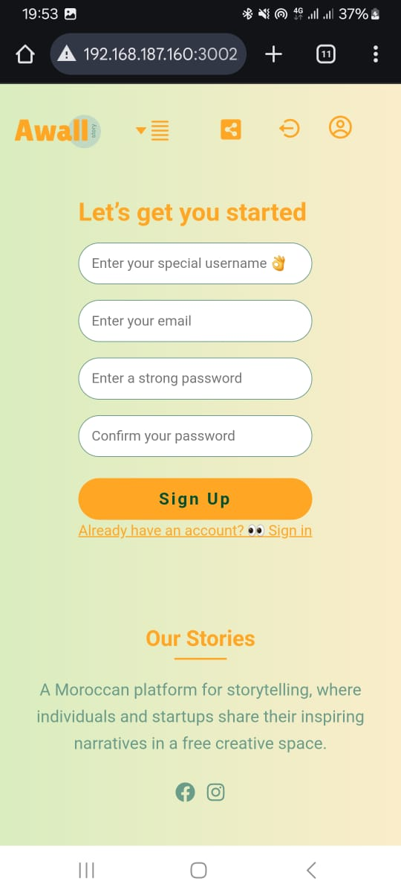

# 📝 AWALL — Storytelling Platform

**AWALL** is a digital storytelling platform that empowers users to share their personal or business stories — either by writing or recording their own voice.  
Built with **React** and **Django REST Framework**, AWALL blends creativity with technology to bring human stories to life.

---

## 📸 project Screenshots
   # Desktop Screenshot:
   <p>
    
    
    
    
    
    
    )" width="200" />
    
    
    
   </p>
   # Mobile Screenshots:
    <p>
        
        
        
        
        
        
        
        
        
        
        
    </p>

## 🌟 Key Features

- 🗣️ **Voice Storytelling** – Record and upload your voice to share your story.  
- ✍️ **Written Stories** – Express yourself through text posts.  
- 🧑‍💼 **Profile Management** – Create a profile with bio, links, and profile photo.  
- 🏠 **Interactive Home Feed** – Browse stories from users with media previews.
- 📝 **commenting on user's post
- 📱 **Fully Responsive** – Works beautifully on both desktop and mobile.

---

---

## 🛠️ Tech Stack

| Category | Technology |
|-----------|-------------|
| **Frontend** | React (JavaScript) , CSS |
| **Backend** | Django, Django REST Framework |
| **Database** | PostgreSQL |
| **Other Tools** | Axios, React Audio Recorder, REST APIs |

---

## 🚀 How to Run Locally

```bash
# Clone the repository
git clone https://github.com/thepythonistm/awall-space

# Navigate into the project
cd awall

# Start frontend (React)
cd frontend
npm install
npm start

# Start backend (Django)
cd ../awallbackend
pip install -r requirements.txt
python manage.py runserver


